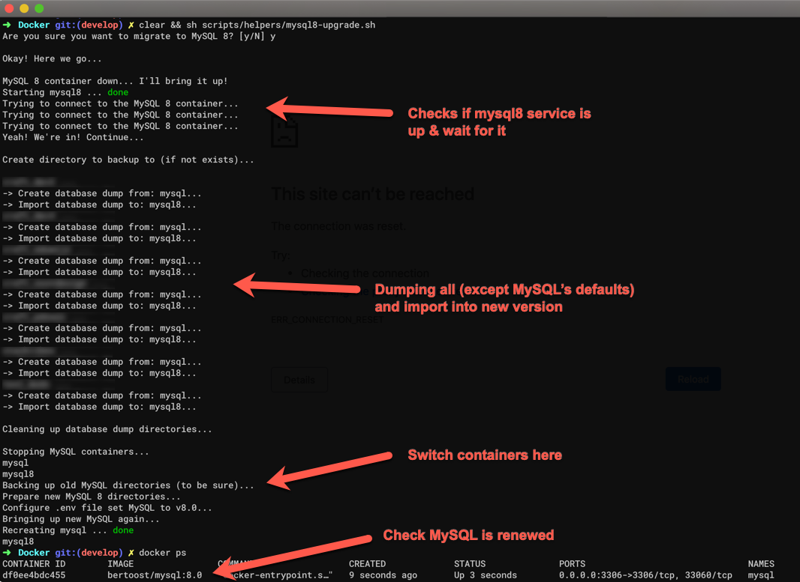

<p align="center"></p>

<hr>

As MySQL is served as separated container, you're not able to use `localhost` as host for your database connection __from inside another container__. Use `mysql` for that, as that would be the name of the Docker container in your stack. As this is the name, inside your Docker-network, this will work.

## Example PHP usage

```php
$database_host = 'mysql'; # this is important
$database_suer = 'root';
$database_password = 'mysql';
$database_name = 'your-db';
```

## Connection from your host

For connecting from the host to your MySQL container, you could use `localhost:3306` to connect.

## MySQL version

Since I provide multiple versions for your local MySQL server/service, you can choose. By Default (because of being backwards compatible) the version `5.7` is used by default. To change the default version, use the next environment variable;

```bash
MYSQL_VERSION=8.0
```

> You can also put this in your `.env` file.

### Storage folder

From the Dev Stack there is a directory configured where the MySQL data is stored, to have it persisted when you restart your host or container. This folder is located in the root `data/mysql/` folder.

### Upgrading

If you're upgrading from 5.7 to 8.0, it's important to migrate. Since it's not a good idea to just update the version. It probably will break your databases. Here some steps how you can achieve a migration;

#### Helper script

I have done the manual steps for you inside a helper script. You can easily start migrating with this script.

```bash
sh scripts/helpers/mysql8-upgrade.sh
```

Now you should be able to connect to `localhost:3306` and see your new MySQL version and your migrated databases.

This is how it will look like;

<p align="center">
    <a href="images/mysql8-upgrade-console.png">
        
    </a>
</p>

#### Manual steps

1. Open the root's `docker-compose.yml` file and find the `mysql` service.
2. Duplicate the MySQL-service block and rename the service and container_name to something else, like `mysql_new`
3. Also change the port-mapping to something like `- "13306:3306"`. This will make the new MySQL version available on another port (13306) from your host machine.
4. Change the `volumes` list to something unique. And then I'm only talking about the local folders, which are before the semicolon (`:`). Like `data/mysql8:/var/lib/mysql`.
5. Use `docker-compose up mysql_new` to bring your new version up. It can take a little while.
6. Use your favorite MySQL client (Sequel Pro / HeidiSql etc.) to connect to both servers on your machine. One on port 3306, the new one on 13306 (see step 3).
7. Duplicate your databases from the old server to the new (export dumps, or transfer data if possible).
8. If you're done with migrating... Bring down your MySQL containers. This can be done with the `docker stop mysql mysql_new` command.
9. Now reset your `docker-compose.yml` back to it's original sate (without the second MySQL service definition).
10. Rename the old version data folder, `data/mysql/` to backup it, like `data/mysql_backup/`.
11. Rename the new version data folder (from step 4) to `data/mysql/`.
12. Change the MySQL version in your environment. See section above.
13. Bring your mysql container back up with `docker-compose up -d mysql`.

If everything went well, you'll have your new MySQL version up and running, even with your old data in it.  
If you don't care about the previous/old data. You can skip a lot of above steps to migrate old database to the new service.